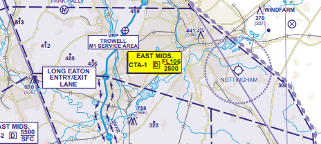
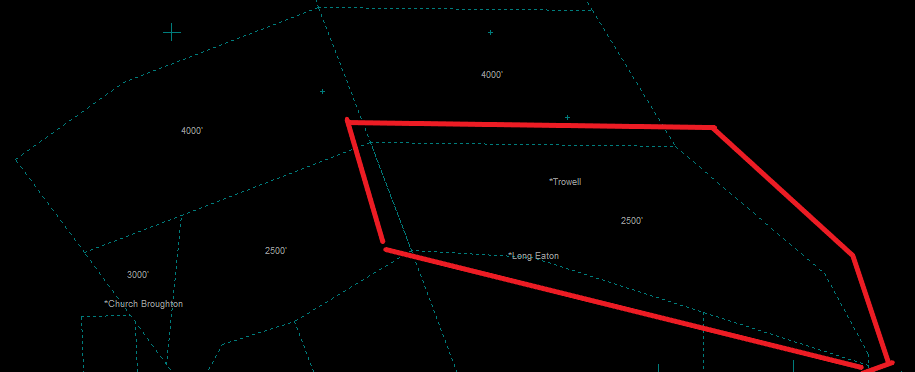

# /Airports/EGxx/Airspace.txt
# What are they?
The Airspace.txt file contains the definitions for the airspace lines as viewed on the Euroscope SMR screens.

# What do they look like in Euroscope?
The image below shows the example airspace as documented in the UK eAIP document 'AD 2.EGNX-4-1 CONTROL ZONE AND CONTROL AREA - ENTRY / EXIT LANES and VRPS'. The airspace area of interest is CTA-1. 

On the Euroscope SMR view this airspace is represented as the area highlighted in the image below.

# How to format them
The source file for the AIRSPACE definitions can be found in the Airspace.txt file. For EGNX this file would be /Airports/EGNX/Airspace.txt. Each line in the file provides the coordinates for Euroscope to draw a line on the SMR screen. The first coordinates must match the final coordinates to form a closed area. 

    <name of airspace> <start point coordinates> <end point coordinates>

E.g. 

    ;East Midlands CTA 1 D 2500-FL105
    EGNX East Midlands CTA N052.59.11.000 W001.28.01.000 N052.59.01.000 W001.09.18.000
    EGNX East Midlands CTA N052.59.01.000 W001.09.18.000 N052.54.21.000 W001.00.06.000
    EGNX East Midlands CTA N052.54.21.000 W001.00.06.000 N052.51.21.000 W000.57.25.000
    EGNX East Midlands CTA N052.51.21.000 W000.57.25.000 N052.50.57.000 W000.57.24.000
    EGNX East Midlands CTA N052.50.57.000 W000.57.24.000 N052.54.56.000 W001.18.04.000
    EGNX East Midlands CTA N052.54.56.000 W001.18.04.000 N052.55.10.000 W001.25.30.000
    EGNX East Midlands CTA N052.55.10.000 W001.25.30.000 N052.59.11.000 W001.28.01.000

# Where to find them
These definitions go into the .SCT file. To find the corresponding entry search for the airspace name, for example 'East Midlands CTA 1 D 2500-FL105'.

# Reference
More information on the file format can be found in the [Euroscope documentation](https://www.euroscope.hu/wp/ese-files-description/).

Documentation on airspace coordinates can be found in the [NATS eAIS Package](https://www.aurora.nats.co.uk/htmlAIP/Publications/2020-12-03-AIRAC/html/index-en-GB.html) under section 'AD 2.17 [airport identifier] Air Traffic Services Airspace' for the relevant airport. 
