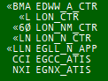

# /Airports/EGxx/Positions.txt
# What are they?
The Positions file contains information about all recognised controller positions for the airport. 

# What do they look like in Euroscope?

In this image Euroscope shows all active controllers. 

# How to format them
These defintions go into the .ESE file. 

    <name of position>:<radio callsign>:<frequency>:<identifier>:<middle letter>:<prefix>:<suffix>:<not used>:<not used>:<Local squawk code start of range>:<Local squawk code end of range>[:<VIS center1 latitude>:<VIS center1 longitude>[: ... ]]
   E.g. (all on one line)

    EGNX_APP:East Midlands Radar:134.170:NXR:X:EGNX:APP:-:-:4550:4570:N052.49.52.000:W001.19.41.000::

The coordinates follow standard EuroScope coordinate formatting.

# Where to find them
Position information can be found by searching the .ESE file for the name of the position. E.g. (without quotes) 'EGNX_APP'

# Reference
Reference documentation can be found in the [Euroscope Documentation](https://www.euroscope.hu/wp/ese-files-description/).