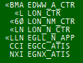

# /Airports/EGxx/Positions_Mentor.txt
# What are they?
The Positions_Mentor file contains information about all recognised controller mentor positions for the airport. 

# What do they look like in Euroscope?

In this image Euroscope shows all active controllers. Mentor positions can either be identified by the three character identifier field (for example NXTM) or name of position. In the image above LON_NM_CTR is a mentor position. 

# How to format them
These definitions go into the .ESE file. The source file for EGNX (the example used below) would be Airports/EGNX/Positions_Mentor.txt.

    <name of position>:<radio callsign>:<frequency>:<identifier>:<middle letter>:<prefix>:<suffix>:<not used>:<not used>:<Local squawk code start of range>:<Local squawk code end of range>[:<VIS center1 latitude>:<VIS center1 longitude>[: ... ]]
   E.g. (all on one line)

    EGNX_TWR:East Midlands Tower:199.998:NXTM:T:EGNX:TWR:-:-:4550:4571:N052.49.52.000:W001.19.41.000::

The coordinates follow standard EuroScope coordinate formatting.

# Where to find them
Position information can be found by searching the .ESE file for the following strings (choose dependent on position) 
    
    EGxx_APP : '[last two characters of name of position]RM'. 
    EGxx_F_APP : '[last two characters of name of position]FM'. 
    EGxx_TWR : '[last two characters of name of position]TM'. 
    EGxx_GND : '[last two characters of name of position]GM'. 
E.g. 
    
    NXFM

# Reference
Reference documentation can be found in the [Euroscope Documentation](https://www.euroscope.hu/wp/ese-files-description/).